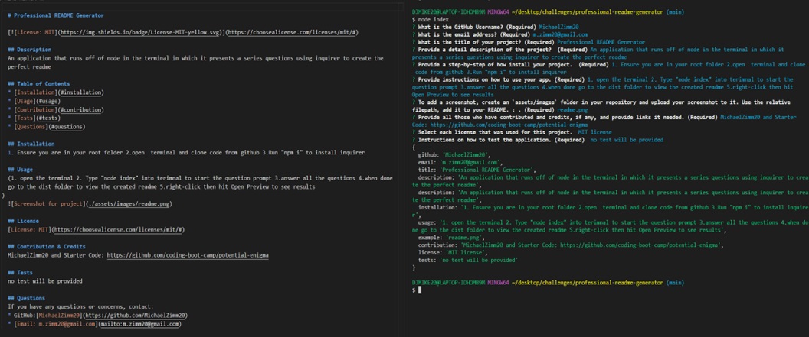
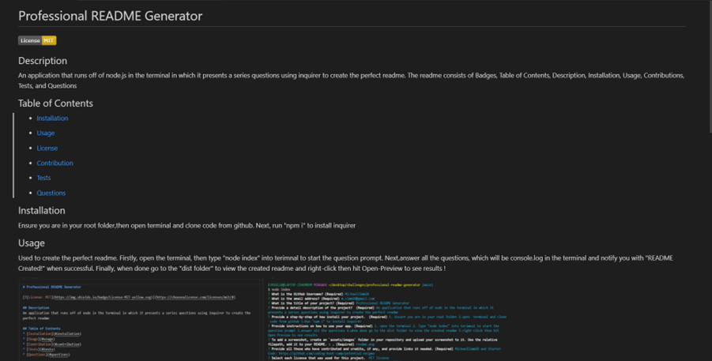
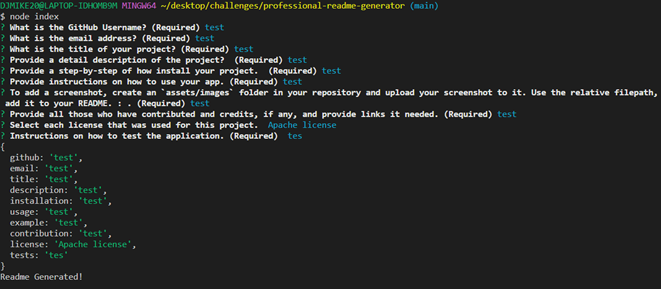
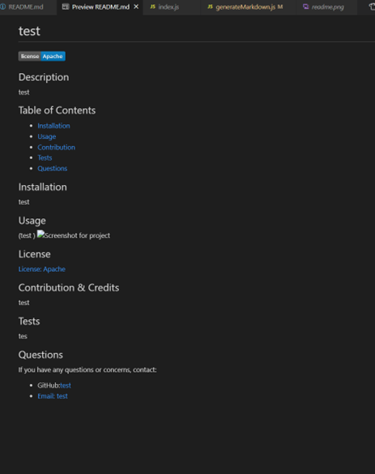
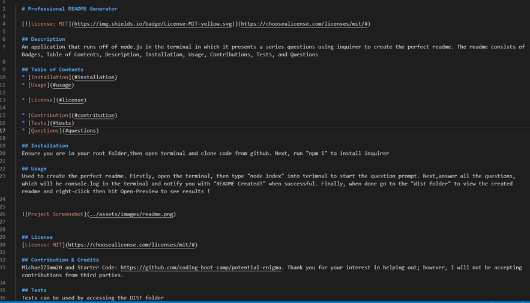
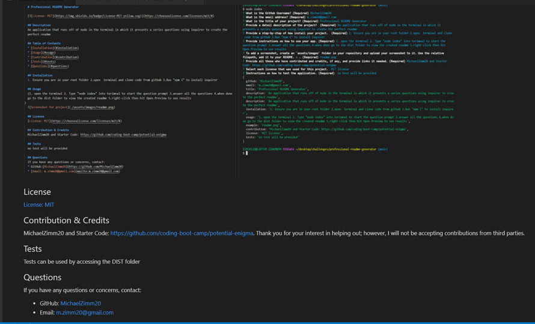

# Professional README Generator 

            

  ## Description
  An application that runs off of node.js in the terminal in which it presents a series questions using inquirer to create the perfect readme. The readme consists of Badges, Table of Contents, Description, Installation, Usage, Contributions, Tests, and Questions

   ## Table of Contents 
  * [Installation](#installation)
  * [Usage](#usage)
  * [License](#license)
  * [Contribution](#contribution)
  * [Tests](#tests)
  * [Important-Links](#Important-Links)
  * [Questions](#questions)

## Usage 
  Used to create the perfect readme. Firstly, open the terminal, then type "node index" into terimnal to start the question prompt. Next,answer all the questions, which will be console.log in the terminal and notify you with "README Created!" when successful. Finally, when done go to the "dist folder" to view the created readme and right-click then hit Open-Preview to see results !

  
  
    
  
    
  
    
  
    
  
    
  
   

## License
  The Following licenses were used in for project demonstration purposes:
  [License: MIT](https://choosealicense.com/licenses/mit/#) 
  [License: Apache](https://choosealicense.com/licenses/apache-2.0/) 
  [License: ISC](https://opensource.org/licenses/ISC)  
  [License: The Unlicense](https://choosealicense.com/licenses/unlicense/) 

## Contribution & Credits
  MichaelZimm20 and Starter Code: https://github.com/coding-boot-camp/potential-enigma. Thank you for your interest in helping out; however, I will not be accepting contributions from third parties.

[How to create a Professional README](https://coding-boot-camp.github.io/full-stack/github/professional-readme-guide)
  
## Tests
* Tests can be used by accessing the DIST folder. No other tests will be provided.

## Important Links 
* GitHub Link: https://github.com/MichaelZimm20/professional-readme-generator

* Deployable Live Link: https://michaelzimm20.github.io/professional-readme-generator/

* Application Demonstration Link: https://drive.google.com/file/d/1oCBirPzZXVpMNzl4rdkZ_VFQb6Yjij-1/view

## Questions 
  If you have any questions or concerns, contact:
  * GitHub: [MichaelZimm20](https://github.com/MichaelZimm20)
  * Email: [m.zimm20@gmail.com](mailto:m.zimm20@gmail.com)

