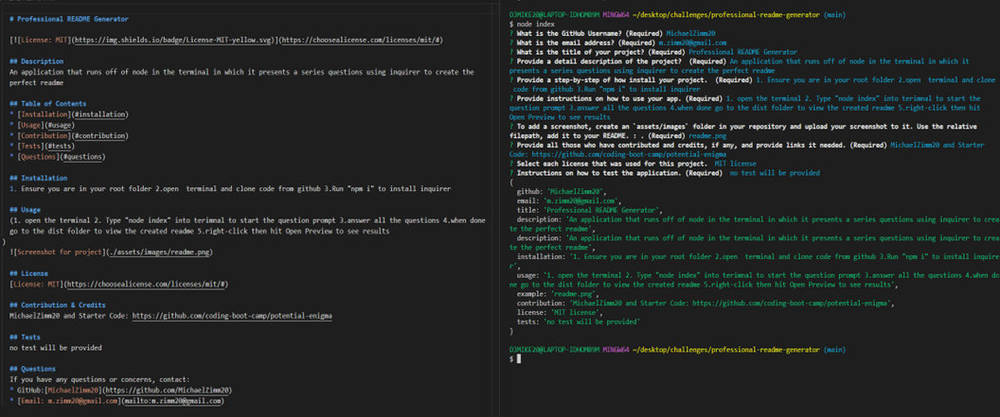

  # Professional README Generator

   

  ## Description
  An application that runs off of node.js in the terminal in which it presents a series questions using inquirer to create the perfect readme. The readme consists of Badges, Table of Contents, Description, Installation, Usage, Contributions, Tests, and Questions

  ## Table of Contents 
  * [Installation](#installation)
  * [Usage](#usage)
  
  * [License](#license)
    
  * [Contribution](#contribution)
  * [Tests](#tests)
  * [Questions](#questions)
  
  ## Installation 
  Ensure you are in your root folder,then open terminal and clone code from github. Next, run "npm i" to install inquirer

  ## Usage 
  Used to create the perfect readme. Firstly, open the terminal, then type "node index" into terimnal to start the question prompt. Next,answer all the questions, which will be console.log in the terminal and notify you with "README Created!" when successful. Finally, when done go to the "dist folder" to view the created readme and right-click then hit Open-Preview to see results !

  
  
 
  
  ## License
  [License: MIT](https://choosealicense.com/licenses/mit/#)

  ## Contribution & Credits
  MichaelZimm20 and Starter Code: https://github.com/coding-boot-camp/potential-enigma. Thank you for your interest in helping out; however, I will not be accepting contributions from third parties.

  ## Tests
  Tests can be used by accessing the DIST folder

  ## Questions 
  If you have any questions or concerns, contact:
  * GitHub: [MichaelZimm20](https://github.com/MichaelZimm20)
  * Email: [m.zimm20@gmail.com](mailto:m.zimm20@gmail.com)
